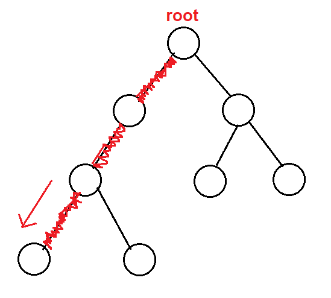
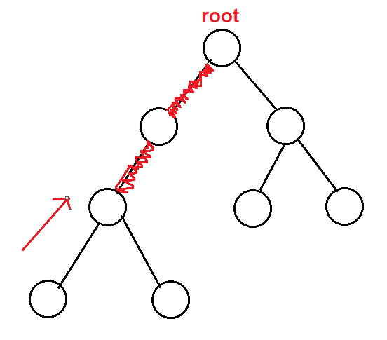
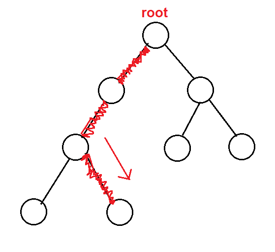
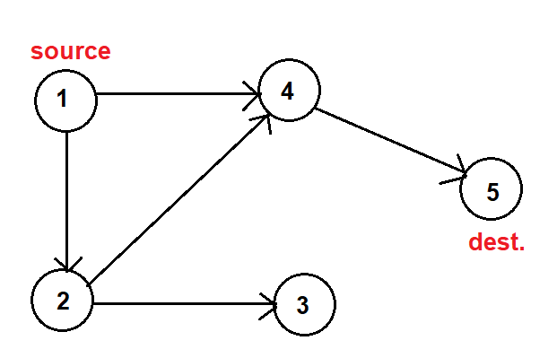
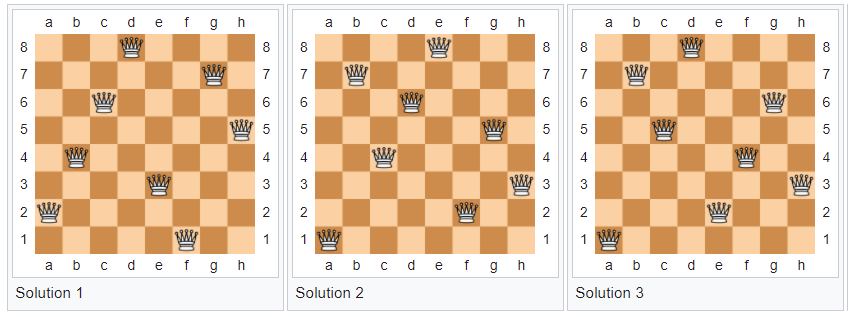

# Backtracking
{: .no_toc }

1. TOC
{:toc}

Backtracking is one of the complete search, aka brute force techniques. Basically, we explore all possible scenarios to find the solution. This is one of the most important techniques in competitive programming. We usually think of a brute force solution first when reading a problem. If the constraint is large, we need to come up with a better way as the complete search can receive TLE (Time Limit Exceeded). Suppose we want to enumerate all permutations of $$ \{ 1,2,3,...,n \} $$, this requires $$ O(n!) $$. So one of the hints for brute force solution is that the problem has small constraint.

### How does it work?

Backtracking is usually implemented recursively. That's why we usually hear the term "recursive backtracking". So how does it work? Imagine we have a tree. Starting with a root node, we choose a path to explore downwards. If we haven't found the solution, we backtrack and explore a path in the subtree. See figures below.

<p float="left">
  
  
  
</p>

This looks very much the same as Depth First Search (DFS) algorithm. In fact, if we implement DFS recursively, we need to use backtracking technique. Below is a Python DFS code that explores all paths from a given source in a graph.

```python
adj = { # create an adjacency list representation of a graph
    1: [2, 4],
    2: [3, 4],
    3: [],
    4: [5],
    5: []
    }
visited = set()

def dfs(v):
    visited.add(v) # explore
    for u in adj[v]:
        dfs(u)
    visited.remove(v) # backtrack

dfs(1)
```

Now let's make DFS print out all of the paths from a given source to a given destination.

```python
adj = { # create an adjacency list representation of a graph
    1: [2, 4],
    2: [3, 4],
    3: [],
    4: [5],
    5: []
    }
visited = set()

def dfs(source, dest, path):
    # explore
    path.append(source)
    visited.add(source)
    

    if source == dest:
        print(path)
    else:
        for u in adj[source]:
            dfs(u, dest, path)
    
    # backtrack
    path.pop()
    visited.remove(source) 

dfs(1, 5, [])
```

Output

```
[1, 2, 4, 5]
[1, 4, 5]
```

If we look at the graph, $$ 1 \rightarrow 2 \rightarrow 4 \rightarrow 5 $$ and $$ 1 \rightarrow 4 \rightarrow 5 $$ are the only 2 paths that go from $$ 1 $$ to $$ 5 $$.

<div style="text-align:center"></div>

We know that DFS can be implemented iteratively by using a stack. Therefore, backtracking can also be implemented iteratively. However, the code will be lengthier, and sometimes not intuitive as using recursion. Below is an iterative DFS code.

```python 
adj = { # create an adjacency list representation of a graph
    1: [2, 4],
    2: [3, 4],
    3: [],
    4: [5],
    5: []
    }

def dfs(v):
    stack = [v]
    visited = set([v])
    while stack:
        node = stack.pop()
        for u in adj[node]:
            if u not in visited:
                stack.append(u)
                visited.add(u)

dfs(1)
```

### Get around maximum recursion depth

Despite of its lengthiness, iteration exists for a reason. Recursion is elegant but it has a limited recursion depth, or we sometimes hear "stack overflows" or `RecursionError: maximum recursion depth exceeded` in Python. There are many ways to get around this. First method is to use iteration if possible. Second method is that we can prune infeasible search space early. When using recursive backtracking, if we encounter a partial solution that won't lead to a full solution, then prune the search and explore a different path. Another way is to optimize your source code. For example, passing array as an argument in a recursive function may cause a problem when you forget to pass by reference. In other words, every time the function calls itself, it will make a copy of the array. Therefore, when dealing with bulky data structures, just make them as global variables (don't do this in production code). Another example is that string manipution in Python can be slow because string in Python is immutable. To avoid this, you can use a list then join it afterwards since list is mutable. If you want to read more about tricks and tips, check out the [Competitive Programming 4](https://cpbook.net/){:target="_blank"} book, section 3.2.3.

### 8 queens problem

One of the classic examples of using backtracking is the 8 queens problem. The problem asks you to place 8 queens on an $$ 8 \times 8 $$ chessboard such that no 2 queens attack each other. This means no 2 queens share the same row, column, or diagonal.

A naive solution would generate all possible positions for 8 queens without checking. There are $$ _{64}C_{8} $$ possibilities. If we check a cell before placing a queen on it, it will reduce the number of possibilities significantly. Specically, we know each queen will occupy 1 row and 1 column, so the number of checkings will equal to the number of permutations of $$ row = [1,3,5,7,2,0,6,4] $$, which is $$ 8! $$. If we further optimize the code by inspecting the 2 diagonal lines, the number of checkings will be less than $$ 8! $$. In general, the time complexity will be sub $$ O(n!) $$.

<div style="text-align:center">
    
    <p style="font-style: italic;">3 solutions to 8 queens problem from Wikipedia</p>
</div>

### $$ N $$ queens problem

$$ N $$ queens problem is a general version of the 8 queens problem. The question asks you to place $$ N $$ queens on an $$ N \times N $$ chessboard such that no 2 queens attack each other.

The idea is the same as the 8 queens problem. Below is a Python solution. But first, try it [here](https://leetcode.com/problems/n-queens/){:target="_blank"}.


```python
# reference: https://leetcode.com/problems/n-queens/discuss/562194/Clean-python-backtrack-40ms
ans = []
board = [-1]*n # use 1D array to store queens positions, index is row, value is the corresponding column
cols, left_diags, right_diags = set(), set(), set() # store previous queens positions

def dfs(row):
    if row == n:
        solution = ['.' * i + 'Q' + '.' * (n - i - 1) for i in board]
        ans.append(solution)
        return
    
    for col in range(n):
        if col not in cols and row - col not in left_diags and row + col not in right_diags:
            cols.add(col)
            left_diags.add(row - col)
            right_diags.add(row + col)
            board[row] = col
            dfs(row + 1)
            cols.remove(col)
            left_diags.remove(row - col)
            right_diags.remove(row + col)
            board[row] = -1
    
dfs(0)
return ans
```

### References

1. [Competitive Programming 4](https://cpbook.net/){:target="_blank"} book, section 3.2.3
2. [Eight queens puzzle](https://en.wikipedia.org/wiki/Eight_queens_puzzle){:target="_blank"} from Wikipedia