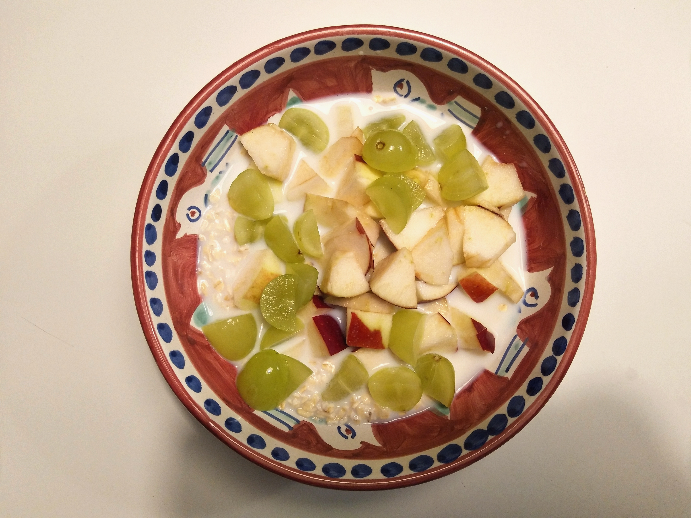

# Quick Food
{: .no_toc }

1. TOC
{:toc}

I don't like cooking. Also going to the grocery store is a pain. However I need food to survive and function well.  

I prefer food that is:
- Quick and easy to make
- Nutritious
- Cheap

Rule: reduce meat/fish as much as you can

### Overnight Oats

| Ingredients | Instructions |
| --- | --- |
| - Oats - Milk - Yogurt - Optional: fruits (apples, bananas, etc.) | - Combine oats, milk, and yogurt - Cover the container, put it in the fridge, and leave it overnight - Take it out in the morning. You can add in some bananas with cinamon, or some apple slices |

*Reference: https://www.fivehearthome.com/overnight-oats-3-ways-pb-banana-raspberry-nutella-coconut-almond/*

    
    
Banana cinnamon overnight oats

### Egg Sandwich

| Ingredients | Instructions |
| --- | --- |
| - Sandwich bread - 2 Eggs - Letuce - Tomato - Mayonnaise - Ketchup - Salt - Black pepper | - Toast sandwiches - Fry 2 eggs - Spread the mayo and ketchup on 2 slices of bread - Place letuce, tomato slices, and fried eggs on the bread - Sprinkle a bit of salt and pepper |

    
    
Egg sandwich

### Mushroom & Ricotta White Pizza

| Ingredients | Instructions |
| --- | --- |
| - Pizza dough (just buy it) - Garlic - Shallot - Ricotta cheese - Cheese (anything works) - Mushrooms - Hoisin sauce (or any kind of salty and sweet sauce) | - Chop garlic, shallot, and mushrooms - Roll the dough until it's flatten - Turn the oven on to $$ 420^\circ F$$ - Spread ricotta over the dough - Sprinkle chopped garlic, shallot, and mushrooms on top - Grate the other cheese and sprinkle it on top - Put the pizza in the oven and wait for 20 minutes |

*Reference: https://www.freshprep.ca/recipes/1034*

    
    
Mushroom & ricotta white pizza

### Tofu Broccoli Pasta

| Ingredients | Instructions |
| --- | --- |
| - Firm tofu - Broccoli - Pasta (any kind) - Tomato sauce - Black pepper | - Put pasta in boil water and leave it for 5 minutes (depending on the type of pasta) - Throw broccoli in boil water with pasta and wait for another 4 minutes - Cut tofu into small cubes and fry them - Combine tofu, broccoli and pasta - You can cook the pasta sauce a bit and add it in the pasta - Sprinkle a bit of black pepper on top |

*Reference: https://www.shelikesfood.com/tofu-broccoli-pasta/*

### Mushroom Pasta

| Ingredients | Instructions |
| --- | --- |
| - Pasta (any kind) - Mushroom - Tomato sauce - Garlic - Butter - Salt - Black pepper | - Put pasta in boil water and leave it for 9 minutes (depending on the type of pasta) - Sauté chopped garlic with a bit of oil and butter - Add mushrooms in the skillet - Spinkle a bit of salt and pepper - Once the mushrooms release their juices, add tomato sauce, and a bit of pasta cooking water. Stir for 5 minutes - Combine pasta and mushrooms sauce |

*Reference: https://www.themediterraneandish.com/mushroom-pasta-recipe/*

### Lentil Spinach Curry

| Ingredients | Instructions |
| --- | --- |
| - Canned lentils (you can also use chickpeas) - Garlic - Onion - Curry powder - Paprika (or any spicy powder) - Tomato paste - Salt - Tumeric - Cumin - Spinach | - Sauté chopped onion and garlic for 1 minute in an instant pot - Add curry powder, paprika, cumin, salt and sauté for around 30 seconds - Pour the lentils into the garlic onion mixture pot - Canned lentils usually have water in them so you don't need to add water; otherwise, add a bit of water in the pot - Add tomato paste - Change the instant pot mode to pressure cook and wait for 20 minutes - Turn off the instant pot and add the spinach and stir for 1-2 minutes |

*Reference: https://www.budgetbytes.com/curried-chickpeas-spinach/*

    
    
Spinach lentil curry with rice

### [SPICY TOFU LETTUCE WRAPS](https://damndelicious.net/2013/01/04/spicy-tofu-lettuce-wraps/)

### [Fried rice](https://tasty.co/recipe/healthier-fried-rice)

### [Tofu Stir-Fry](https://www.delish.com/cooking/recipe-ideas/a26090091/tofu-stir-fry-recipe/)

### Snacks

- No junk food
- Fruits (apples, bananas, oranges, grapes, etc.)
- Nuts
- Baby carrots

