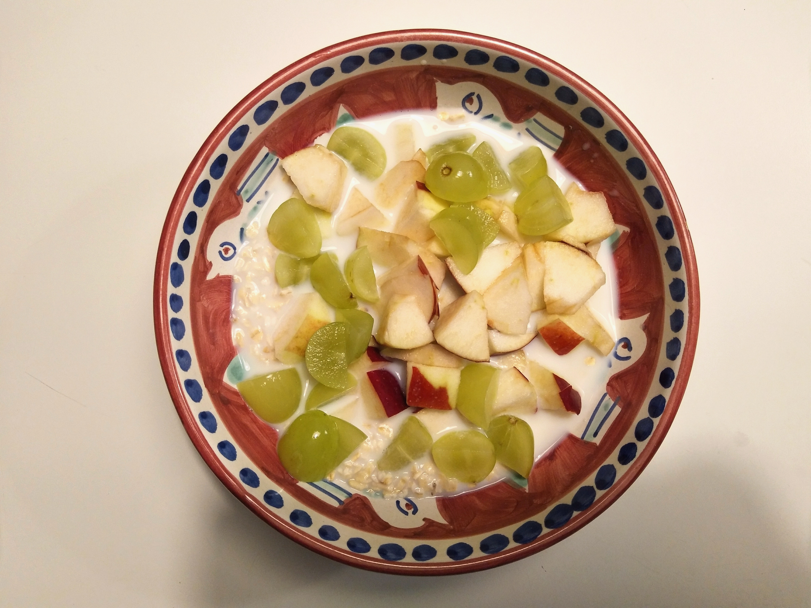
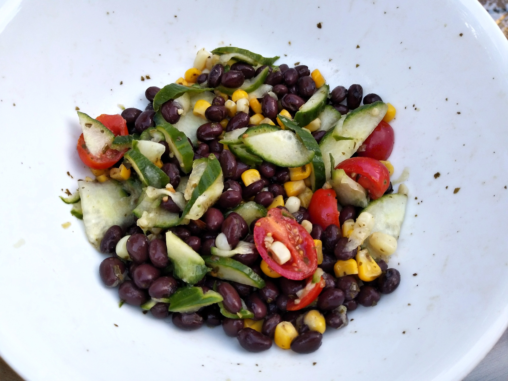
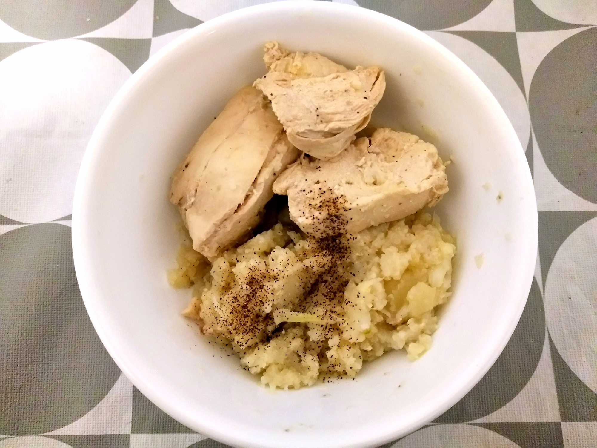
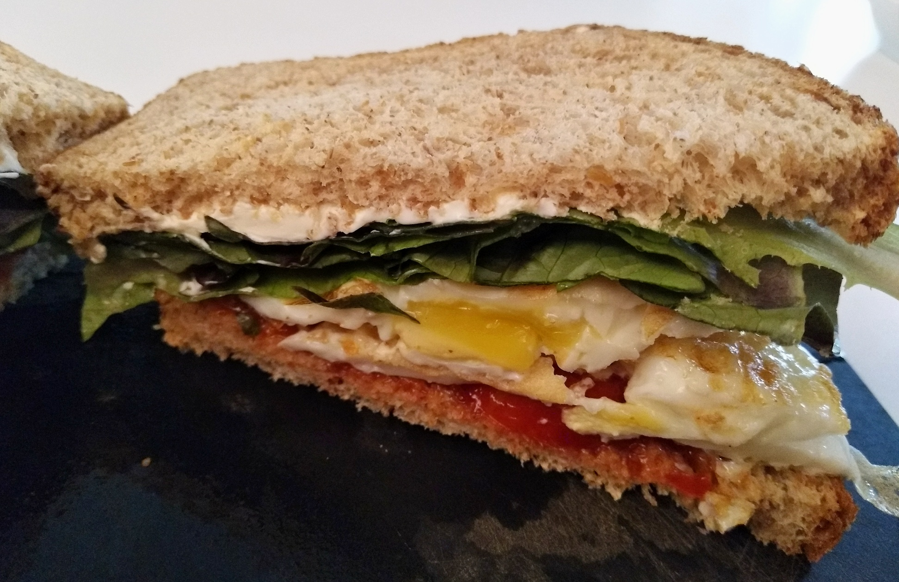
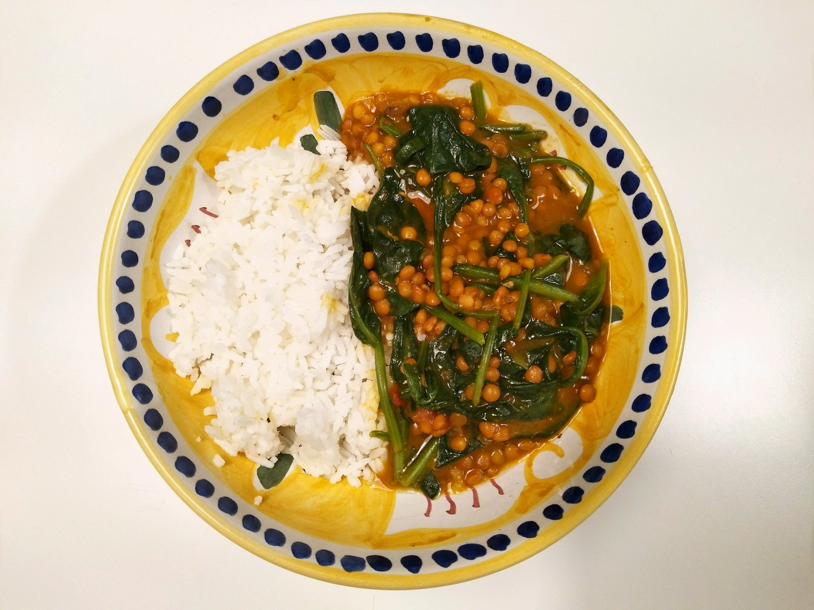
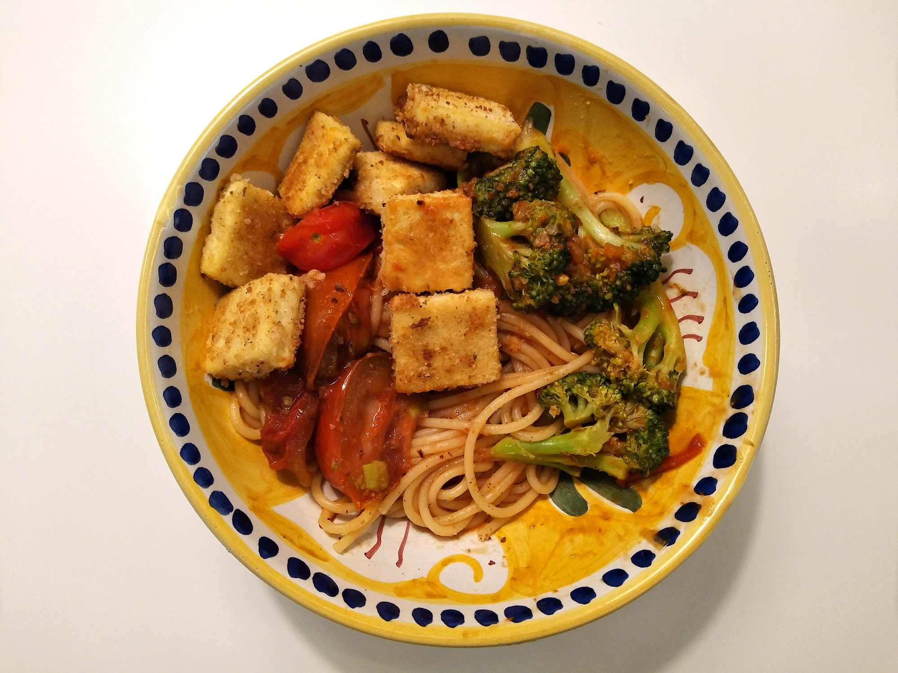
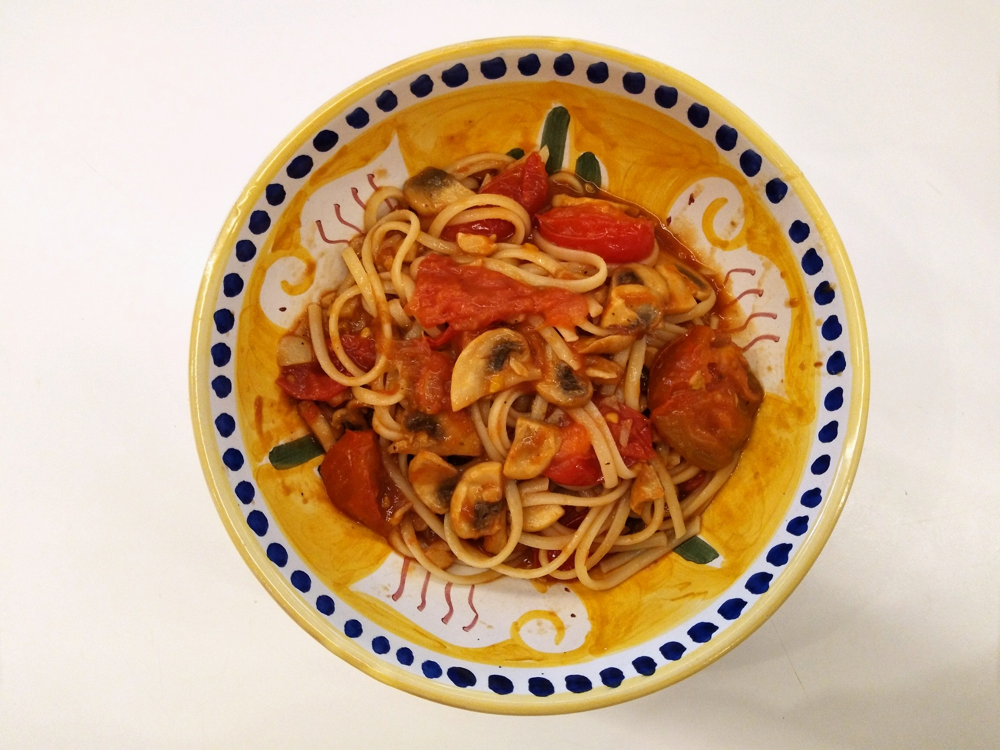
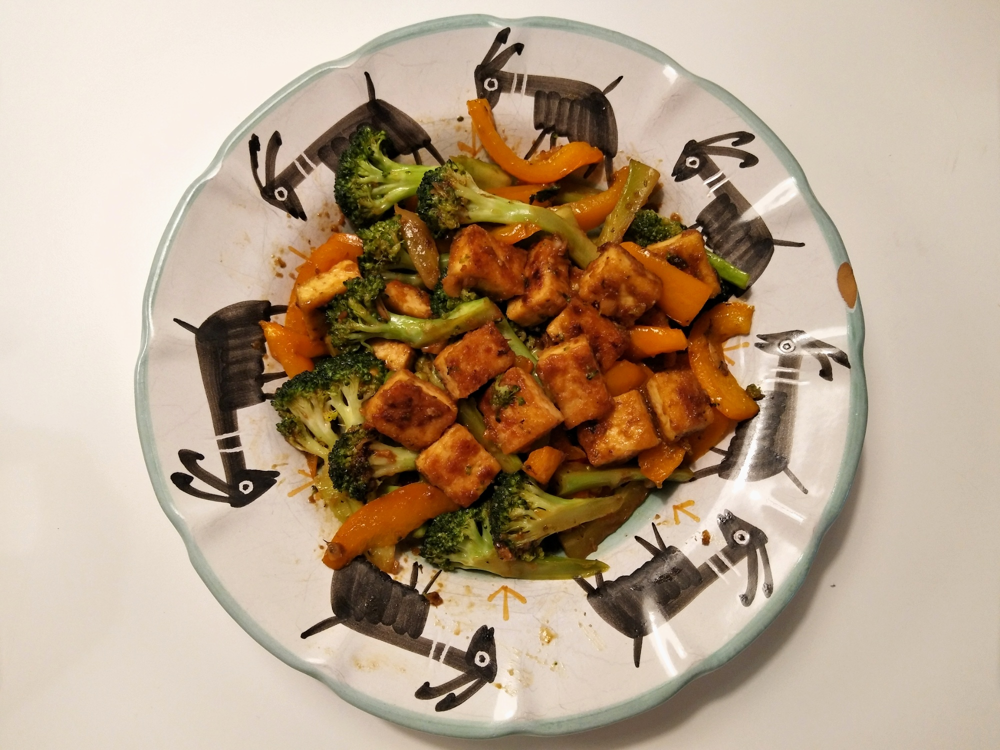
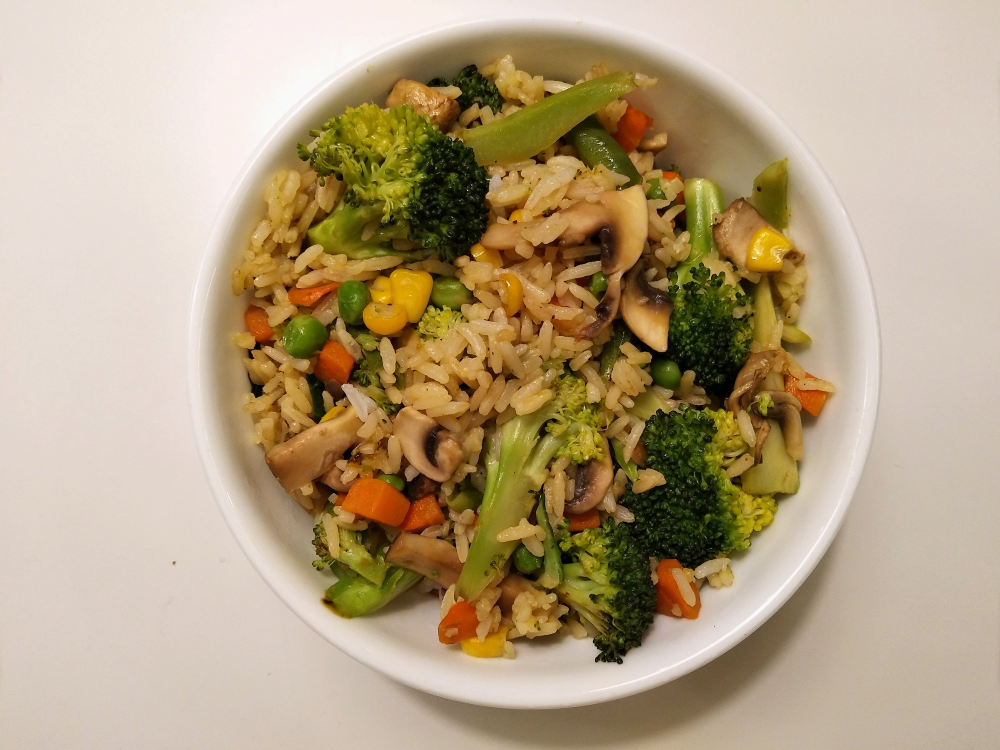

# Simple Food (if I can make it, so can you)
{: .no_toc }

1. TOC
{:toc}

I prefer food that is:
- Quick and easy to make
- Nutritious
- Cheap

This MMM guy has a good [post](https://www.mrmoneymustache.com/2012/03/29/killing-your-1000-grocery-bill/){:target="_blank"} on how to save money on grocery shopping

These recipes have been tested by me :slightly_smiling_face:

## Super quick

### Oats with fruits and milk

| Ingredients | Instructions |
| --- | --- |
| - Oats - Milk - Fruits (apples, bananas, etc.) | - Combine oats, milk, some fruits like banana slices with cinamon, or   apple slices or grapes |

    
    
Oats with apples, grapes and milk

### Chicken Broccoli Potatoes

| Ingredients | Instructions |
| --- | --- |
| - Chicken thigh - Broccoli - Potatoes (any) | - Steam the chicken, broccoli, and potatoes  |

### Pesto Chickpea Salad

| Ingredients | Instructions |
| --- | --- |
| - Canned Chickpeas - Basil pesto - Mayonnaise | - Rinse and drain the chickpeas - Add mayo, pesto, and chickpeas to a bowl and mix them well |

### Black Beans Salad

| Ingredients | Instructions |
| --- | --- |
| - Canned black beans - Frozen corn - Tomatoes - Cucumber (optional) - Olive oil - Vinegar (or lime juice) - Sugar - Salt and pepper - Basil pesto (optional) | - Mix everything together |

    
    
Black beans salad (I ate a few then realized I should take a picture)

### Crunchy Wrap

| Ingredients | Instructions |
| --- | --- |
| - Cashews or nuts - Peanut butter - Honey or maple syrup - Vinegar - Coleslaw - Chickpeas - Tortilla | - Chop the nuts - Mix peanut butter, honey/maple syrup, vinegar together - Add coleslaw and chickpeas to the salad dressing mixture, then mix well - Wrap the salad with tortillas  |

*Reference: https://youtu.be/PlHuORrY8t8?t=991*

### Couscous Salad

| Ingredients | Instructions |
| --- | --- |
| - Couscous - Cucumber - Tomatoes - Bell pepper - Garlic powder - Feta - Vinegar  | - Add hot water and garlic powder to the couscous with the ratio 1:1, then wait for 5 minutes - Chop cucumber, tomatoes, bell pepper, and feta - Combine the chopped ingredients with the couscous and mix them well - Add vinegar, maybe a bit of salt and pepper for taste |

*Reference: https://youtu.be/PlHuORrY8t8?t=67*

### Banana Peanut Butter Sandwich

| Ingredients | Instructions |
| --- | --- |
| - Banana(s) - Peanut butter - Sandwich bread | - Spread the peanut butter on 2 slices of bread - Place banana slices on the bread |

### Egg Mayo Sandwich

| Ingredients | Instructions |
| --- | --- |
| - Sandwich bread - Eggs - Letuce - Mayonnaise - Salt - Pepper | - Boil the eggs - Mix boiled eggs with mayo - Spread the mixture on one slice of bread - Sprinkle a bit of salt and pepper |

### Poached Eggs & Avocado

| Ingredients | Instructions |
| --- | --- |
| - 4 eggs - 1 avocado | - Poach the eggs - Sprinkle a bit of salt of pepper - Cut the avocado in half and eat with the eggs |

### Chicken, Cauliflower, Potato Mashup

| Ingredients | Instructions |
| --- | --- |
| - Chicken breast - Cauliflower - Potatoes (any) - Bouillon cube | - Chop the potatoes into byte size - Cut the cauliflower into small florets - Put the potatoes, cauliflower florets, and chicken breast into a pot - Add a bit of water (maybe 1 cup) - Add the scrumbled bouillon cube into the pot - Cover, bring to a boil, and wait for around 15 minutes - Smash the potatoes and califlowers | 

    
    
Chicken, cauliflower, potato mashup

## Slightly quick

### Egg Sandwich

| Ingredients | Instructions |
| --- | --- |
| - Sandwich bread - 2 Eggs - Letuce - Tomato - Mayonnaise - Ketchup - Salt - Black pepper | - Toast sandwiches - Fry 2 eggs - Spread the mayo and ketchup on 2 slices of bread - Place letuce, tomato slices, and fried eggs on the bread - Sprinkle a bit of salt and pepper |

    
    
Egg sandwich

### Zucchini Frittata

| Ingredients | Instructions |
| --- | --- |
| - 2 eggs - 1 zucchini - Salt and pepper | - Chop zucchini into thin slices - Heat the oil in the skillet - Add chopped zucchini and stir for a few seconds - Beat the eggs in a bowl and add the beaten eggs in the skillet - Sprinkle a bit of salt and pepper  |

### Brown Rice Noodle

| Ingredients | Instructions |
| --- | --- |
| - Brown rice noodles - Carrots - Cucumber - Eggs - Edamame - Chicken bouillon cube | - Boil the eggs - Chop carrots and cucumber - In a bowl, add  hot water and a chicken bouillon cube with the ratio 1 cup water:1 cube - Add noodles, chopped carrots, chopped cucumber, edamame, and eggs to the broth |

*Reference: https://www.cookinglight.com/food/recipe-finder/vegetable-brown-rice-noodle-salad-recipe*

### Lentil Spinach Curry

| Ingredients | Instructions |
| --- | --- |
| - Canned lentils (you can also use chickpeas) - Garlic - Onion - Curry powder - Paprika (or any spicy powder) - Tomato paste - Salt - Tumeric - Cumin - Spinach | - Sauté chopped onion and garlic for 1 minute in an instant pot - Add curry powder, paprika, cumin, salt and sauté for around 30 seconds - Pour the lentils into the garlic onion mixture pot - Canned lentils usually have water in them so you don't need to add water; otherwise, add a bit of water in the pot - Add tomato paste - Change the instant pot mode to pressure cook and wait for 20 minutes - Turn off the instant pot and add the spinach and stir for 1-2 minutes |

*Reference: https://www.budgetbytes.com/curried-chickpeas-spinach/*

    
    
Spinach lentil curry with rice

### Stir-fried Chicken, Cabbage/Brussels Sprouts, and Nuts

| Ingredients | Instructions |
| --- | --- |
| - Nuts (any) - Chicken breast - Cabbage or brussels sprouts - Salt and pepper | - Stir the chicken and chopped cabbage in a skillet - Add a bit of salt and pepper - Add some nuts |

## Not too quick

### Mushroom & Ricotta White Pizza

| Ingredients | Instructions |
| --- | --- |
| - Pizza dough (just buy it) - Garlic - Shallot - Ricotta cheese - Cheese (anything works) - Mushrooms - Hoisin sauce (or any kind of salty and sweet sauce) | - Chop garlic, shallot, and mushrooms - Roll the dough until it's flatten - Turn the oven on to $$ 420^\circ F$$ - Spread ricotta over the dough - Sprinkle chopped garlic, shallot, and mushrooms on top - Grate the other cheese and sprinkle it on top - Put the pizza in the oven and wait for 20 minutes |

*Reference: https://www.freshprep.ca/recipes/1034*

    
    
Mushroom & ricotta white pizza

### Tofu Broccoli Pasta

| Ingredients | Instructions |
| --- | --- |
| - Firm tofu - Broccoli - Pasta (any kind) - Tomato sauce - Garlic - Bread crumbs | - Put pasta in boil water and leave it for 9 minutes (depending on the type of pasta) - Cut tofu into small cubes, dip in bread crumbs, then fry them - Cut the broccoli - Combine tofu, broccoli and pasta - You can cook the pasta sauce a bit and add it in the pasta - Sprinkle a bit of black pepper on top |

    
    
Tofu Broccoli Pasta

### Mushroom Spaghetti

| Ingredients | Instructions |
| --- | --- |
| - Spaghetti  - Mushroom - Tomato sauce - Garlic - Butter - Salt - Black pepper | - Put pasta in boil water and leave it for 9 minutes (depending on the type of pasta) - Sauté chopped garlic with a bit of oil and butter - Add mushrooms in the skillet - Spinkle a bit of salt and pepper - Once the mushrooms release their juices, add tomato sauce, and a bit of pasta cooking water. Stir for 5 minutes - Combine pasta and mushrooms sauce |

*Reference: https://www.themediterraneandish.com/mushroom-pasta-recipe/*

    
    
Mushroom Spaghetti

### Tofu Stir-Fry

| Ingredients | Instructions |
| --- | --- |
| Tofu - Firm tofu - Breadcrumbs - Oil | - Dip small chunks of tofu in the breadcrumbs - Fry them with oil until golden |
| Stir fry - Garlic - Ginger - Broccoli - Bell pepper - Salt | - Sauté chopped garlic and ginger until fragrant - Add a bit of salt - Stir in string broccoli and bell pepper for about 8 minutes |
| Sauce - Soy sauce - Sesame oil - Cornstarch - Sugar - Water | - Mix soy sauce, sesame oil, water, sugar, and cornstarch - Throw fried tofu chunks into the stir fry skillet - Add sauce mixture to pan - Stir until the sauce is thickened |

*Reference: https://www.delish.com/cooking/recipe-ideas/a26090091/tofu-stir-fry-recipe*

    
    
Tofu Stir-Fry

### Fried rice

| Ingredients | Instructions |
| --- | --- |
| - Garlic - Black pepper - Cooked rice - Broccoli - Carrots - Peas - Soy sauce - Mushrooms - Oil - Salt | - Sauté chopped garlic until fragrant - Add chopped broccoli and carrots with a bit of salt and black pepper and stir for about 5 minutes - Add chopped mushrooms and peas and stir for another 5 minutes - Add cooked rice and a bit of soy sauce and stir until everything is well cooked

*Reference: https://tasty.co/recipe/healthier-fried-rice*

    
    
Fried rice

## Snacks

- No junk food
- Fruits (apples, bananas, oranges, grapes, etc.)
- Nuts
- Baby carrots
